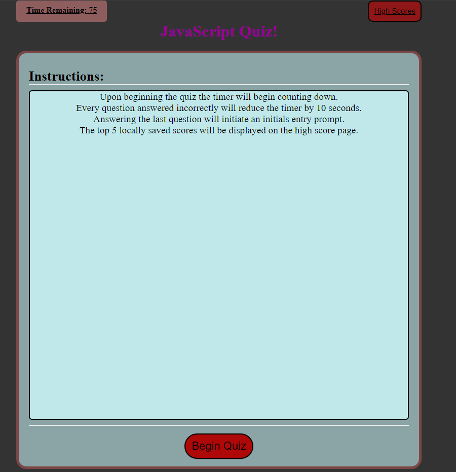

# javascript-quiz-game

A quiz game about JavaScript, made in JavaScript!

## Instructions:
Answer 5 questions in 75 seconds.
Each incorrect answer reduces time by 10 seconds.

## Details:
Your score is your time.
Enter your initials upon completion.
The top 5 scores are displayed upon confirming initials.
High scores are saved locally.

### Website:

https://raymondcerneytech.github.io/javascript-quiz-game/

### Preview:

